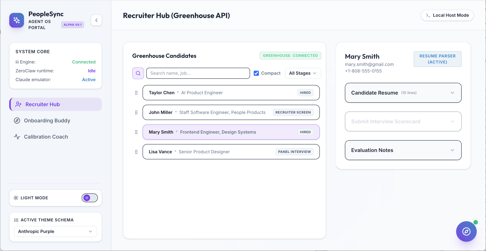
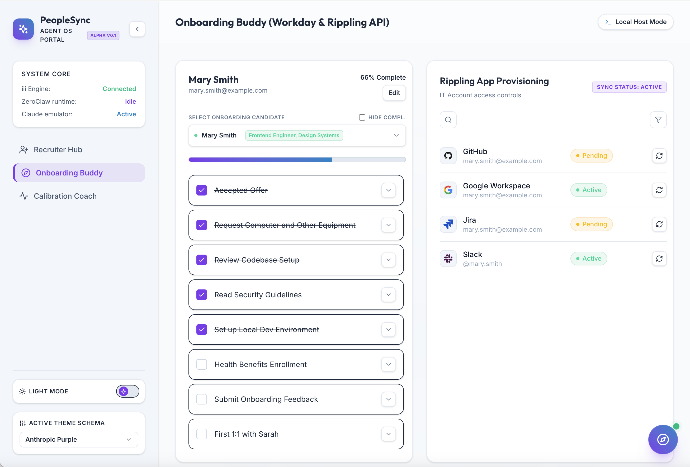
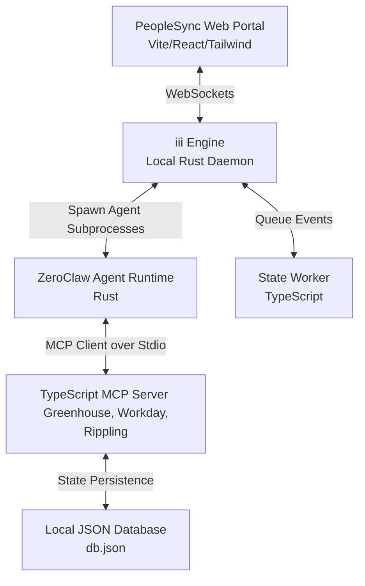

# PeopleSync: AI-Native Employee Lifecycle Platform

Welcome to **PeopleSync**, a decentralized, AI-native employee lifecycle platform demonstrating advanced full-stack integration and autonomous agent orchestration. 

This repository implements a prototype for candidate recruiting (Greenhouse ATS), onboarding checklists (Rippling account provisioning), and peer review calibration (Workday directory) using a hybrid **Rust agent runtime ([ZeroClaw](https://www.zeroclawlabs.ai/))** and **TypeScript services**, orchestrated via **[iii.dev](https://iii.dev/)** as the underlying network and service bus.

**Live Interactive Demo**: [PeopleSync Demo](https://developertogo.github.io/peoplesync)

> Below are samples of the user interface:





---

## 1. Technical Stack & Architecture

Unlike traditional web applications, PeopleSync is built around an **Agent OS** paradigm rather than a monolithic Model-View-Controller (MVC) pattern.



### Why Agent OS is Superior to Traditional MVC

| Dimension | Traditional MVC | PeopleSync Agent OS |
| :--- | :--- | :--- |
| **Data Binding** | Hardcoded REST controllers query specific SQL tables directly. | Decoupled tool handlers expose capabilities dynamically via the **Model Context Protocol (MCP)**. |
| **Logic Execution** | Synchronous backend routes block request threads while running business logic. | Asynchronous, event-driven **Workers** monitor states and coordinate LLM runs offline. |
| **AI Integration** | Web app calls LLM APIs synchronously, leading to massive lag and request timeouts. | The **[iii.dev](https://iii.dev/)** event bus handles triggers and streams agent thoughts in real-time over WebSockets. |
| **Extensibility** | Adding features requires database migrations and updating backend controllers. | Adding capabilities only requires registering a new MCP tool. Agents automatically discover and use it. |

---

## 2. Platform Core Engines

### A. ZeroClaw (Agent Runtime)
**[ZeroClaw](https://www.zeroclawlabs.ai/)** is a high-performance, secure Rust-based agent runtime. 
* **Role**: It acts as the native **MCP Client**. It reads agent configurations, connects to the MCP tool server, handles the LLM reasoning-loop (calling tools, parsing parameters, feeding outputs back), and coordinates prompts.
* **Security & Sandboxing**: Enforces a deny-by-default runtime. Directories and command execution scopes are strictly sandboxed.
* **Efficiency**: Loads in `< 10ms` and consumes less than `5MB` of RAM.

### B. iii.dev (Service Bus)
**[iii.dev](https://iii.dev/)** runs as a local background process (written in Rust) that functions as a WebSocket-based message broker.
* **Function Registration**: Workers announce their custom TypeScript functions (e.g. `workday::get_profile`) to the engine.
* **Reactive Triggers**: Automates actions based on state mutations (e.g., when a candidate is updated to `"hired"` in the Greenhouse recruiter hub, a trigger wakes up the Rippling worker to provision email and Slack accounts).
* **Real-time Streaming**: Connects directly to the React UI via the `iii-browser-sdk` to stream agent thoughts and tool executions dynamically.

---

## 3. Extensibility: Adding New Agents & MCP Tools

Adding new features, agents, or tools is modular and does not require rewriting database controllers or frontend routing.

### 1. Adding a New MCP Tool
Add the tool's schema definition and execution logic in [mcp-server/src/index.ts](file:///Users/chung/sandbox/anthropic/anthropic-people-products-job/peoplesync/mcp-server/src/index.ts). ZeroClaw will discover it automatically on the next startup:
```typescript
// inside /mcp-server/src/index.ts
{
  name: "feedback_get_team_pulse",
  description: "Retrieve aggregated anonymous weekly pulse survey scores.",
  inputSchema: {
    type: "object",
    properties: {
      teamId: { type: "string" }
    },
    required: ["teamId"]
  }
}
```

### 2. Creating a ZeroClaw Agent Configuration
Add a new TOML config file under `agents/` mapping the agent alias and system prompts:
```toml
# agents/teamwork_agent.toml
[agent]
name = "TeamworkPulseAgent"
system_prompt = "You are the Teamwork & Culture Pulse Agent at Anthropic..."

[providers.models.claude]
base_url = "http://localhost:8000/v1"
api_key = "local-mock-key"

[mcp_servers.hr_platform]
command = "node"
args = ["/Users/chung/sandbox/anthropic/anthropic-people-products-job/peoplesync/mcp-server/build/index.js"]
```

### 3. Registering the Trigger on iii.dev
Define the event listener in [workers/src/index.ts](file:///Users/chung/sandbox/anthropic/anthropic-people-products-job/peoplesync/workers/src/index.ts):
```typescript
worker.registerTrigger("pulse::survey_cycle_closed", async (payload: { teamId: string }) => {
  await worker.trigger({
    function_id: "agent::run_teamwork_pulse",
    payload: {
      agentConfig: "agents/teamwork_agent.toml",
      teamId: payload.teamId
    }
  });
});
```

---

## 4. Run Modes & Mocking Status

The frontend application supports three distinct run modes configurable directly via URL query arguments:

| Mode | URL Parameter | Description |
| :--- | :--- | :--- |
| **Pure Mock Static Mode** | `?mode=static` | Bypasses all backend networking entirely. Operates 100% client-side in the browser utilizing static constants and mock client responses, making it perfect for static hosting (e.g. GitHub Pages). |
| **Local DB JSON Mode** | `?mode=local` | Communicates with the local database backend (`db.json`) but prevents writing frontend state modifications back, protecting local datasets. |
| **Remote DB Mode** | *(Default)* | Full bidirectional data synchronization with the backend API service, processing and saving state mutations in real time. |

🚀 **Live Interactive Demo**: Try the UI instantly in your browser in Pure Mock Static Mode: [PeopleSync Demo](https://developertogo.github.io/peoplesync)

### Production Transitions
To transition from the local offline development mock setup to production:
1. **Live Claude Model Integration**:
   - Change `base_url` in your agent TOML configuration files to the official Anthropic API endpoint (`https://api.anthropic.com/v1/messages`).
   - Replace the mock API key `"local-mock-key"` with your valid `ANTHROPIC_API_KEY`.
2. **Real Database & API Integration**:
   - To replace the mock JSON DB with a local SQLite database or third-party platforms (Greenhouse, Workday, Rippling), update the request handler hooks inside the MCP Server (`mcp-server/src/index.ts`). Refer to:
     - [Local SQLite Setup Guide](file:///Users/chung/sandbox/anthropic/anthropic-people-products-job/local_sqlite_setup.md)
     - [Real API Integrations Guide](file:///Users/chung/sandbox/anthropic/anthropic-people-products-job/real_api_integrations_guide.md)

---

## 5. Local Setup & Operations

### 1. Build TypeScript Projects
Install dependencies and compile the TypeScript workers and MCP server:
```bash
npm install
npm run build
```

### 2. Quick Launch (Recommended)
You can launch both the frontend (Vite) and the backend (MCP Server) simultaneously with a single command:
```bash
bin/start
```
*Optional parameters*:
To run utilizing the local JSON database mock values explicitly:
```bash
bin/start --local
```

### 3. Manual Step-by-Step Launch
If you prefer running services individually:

#### A. Launch iii.dev Daemon
Start the local message bus:
```bash
iii --config config.yaml
```

#### B. Launch Workers
Start the background triggers daemon:
```bash
node workers/build/index.js
```

#### C. Launch React Portal
Run the Vite development server locally:
```bash
npm run dev --workspace=web-app
```
Open `http://localhost:5173` to interact with the dashboard.
